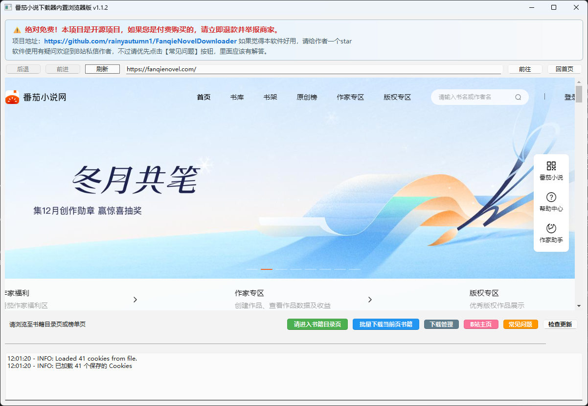
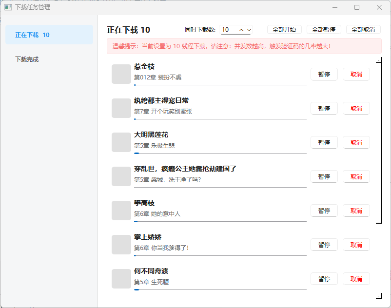
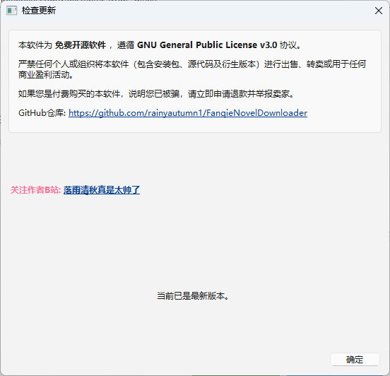

# 番茄小说下载器 (Fanqie Novel Downloader)

[](LICENSE)
[](https://github.com/rainyautumn1/FanqieNovelDownloader/releases)
[](https://github.com/rainyautumn1/FanqieNovelDownloader/stargazers)


> **📥 [点击下载最新 Windows 绿色版 (.exe)](https://github.com/rainyautumn1/FanqieNovelDownloader/releases)**  
> *解压即用，无需安装 Python 环境*

## 📖 简介
这是一个基于 Python (PySide6) 开发的高级**番茄小说下载工具**（Tomato Novel Downloader）。
它集成了内置浏览器，支持用户直接浏览**番茄小说网 (番茄免费小说)**，支持 **SVIP 账号登录**以获取完整内容。
软件提供灵活的**单本下载**与**榜单批量下载**功能，支持将小说导出为 **TXT**、**EPUB**、**Markdown** 等格式，是您备份和离线阅读番茄小说的最佳助手。

**核心关键词**: 番茄小说下载, 番茄免费小说, 小说爬虫, 批量下载, 导出EPUB, TXT下载, 离线阅读, 电子书制作

---

## 📸 软件截图 (Screenshots)

| **主界面 / 内置浏览器** | **批量下载 / 任务管理** |
|:---:|:---:|
|  |  |
| *内置浏览器直接阅读与下载* | *多任务并发与实时进度监控* |

| **自动更新** |
|:---:|
|  |
| *支持自动检测更新与安装* |

---

## ⚠️ 重要免责声明**
1. **仅供学习研究**: 本工具仅供个人学习 Python 网络爬虫技术、GUI 开发及研究使用。
2. **版权声明**: 请尊重小说作者及平台的版权。**严禁**使用本工具进行任何形式的商业盈利、非法传播或侵犯知识产权的行为。
3. **责任自负**: 使用本工具产生的任何法律后果由使用者自行承担。

---

## 📅 更新日志

> 完整更新记录请查看 [CHANGELOG.md](CHANGELOG.md)

### 最新更新 (2025-12-20)
- **下载管理系统重构**: 强制单线程下载以对抗风控，支持智能任务调度与实时进度反馈。
- **反爬虫增强**: 升级文本反混淆算法，修复乱码与缺字问题；强制 UTF-8 编码。
- **界面优化**: 整合下载选项，增加风控提示。
- **功能增强**: 支持断点续传、自定义下载间隔、书籍简介自动归档。

---

## 核心功能

### 1. 📖 内置浏览器与账号互通
- **内置 Chromium 内核浏览器**: 直接在软件内浏览番茄小说官网，无需手动复制粘贴 URL。
- **SVIP 登录支持**: 支持在内置浏览器中登录您的 SVIP 账号。软件会自动同步 Cookie，从而**解锁并下载 SVIP 专属加密章节**。
- **持久化登录**: 新增浏览器数据持久化存储功能，软件重启后**自动保持登录状态**，无需重复扫码。

### 2. ⚡ 智能单本下载
当您浏览至某本书的**目录页**时，软件会自动检测并激活下载按钮：
- **自定义章节选择**:
  - 下载全本。
  - 仅下载前 N 章。
  - 自定义章节范围 (如: 10-50)。
- **文件输出选项**:
  - **合并模式**: 所有章节保存为一个 TXT/EPUB 文件。
  - **拆分模式**: 每一章保存为一个单独的 TXT/MD 文件，并自动归档至书名文件夹。
- **格式支持**: TXT (纯文本), EPUB (电子书), MD (Markdown)。

### 3. 📦 榜单批量下载
当您浏览至**排行榜**或**分类书库**页面（如“男频-新书榜-科幻末世”）时，软件会激活批量下载功能：
- **一键批量**: 支持下载当前榜单页面的前 N 本热门书籍。
- **试读控制**: 可设置每本书仅下载前 X 章（例如仅下载前 10 章预览）。
- **文件管理**:
  - **分章保存**: 新增批量分章下载选项。勾选后，每本书会自动创建一个以书名命名的独立文件夹，章节文件单独存放。
  - **智能归档**: 自动根据榜单层级创建存储目录，分类清晰。
  - 示例路径: `downloads\男频\新书榜\科幻末世\书名\001_第一章.txt` (开启分章模式)

### 4. 🛡️ 核心技术特性
- **字符反混淆 (Anti-Obfuscation)**: 内置特定算法，自动还原被网站混淆的字体字符。
- **多线程处理**: 界面操作与下载任务分离，下载过程中界面不卡顿。
- **实时反馈**: 底部状态栏和日志窗口实时显示当前的下载进度、速度及错误信息。

---

## 📈 Star History

[](https://star-history.com/#rainyautumn1/FanqieNovelDownloader&Date)

---

## 技术栈
- **语言**: Python 3.8
- **GUI 框架**: PySide6 (Qt WebEngine)
- **网络请求**: Requests
- **HTML 解析**: BeautifulSoup4, lxml
- **电子书生成**: EbookLib

---

## 使用指南

### 1. 环境准备
确保已安装 Python 3.8+ 版本。
安装项目依赖：
```bash
pip install -r requirements.txt
```

### 2. 启动程序
直接运行启动脚本或 Python 主程序：
```bash
# Windows 用户推荐直接运行
run.bat

# 或手动运行
python main.py
```

### 3. 操作流程

#### A. 下载单本小说
1. 在软件内置浏览器中，点击想看的书，进入**书籍目录页**（网址通常包含 `/page/`）。
2. 右下角 **"下载此书"** 按钮变亮。
3. 点击按钮，在弹出的对话框中选择：
  - 下载范围（全部/自定义）。
  - 是否拆分章节文件。
  - 目标格式 (TXT/EPUB/MD)。
4. 确认后开始下载。

#### B. 批量下载榜单
1. 在内置浏览器中点击 **"排行榜"** 或 **"书库"**。
2. 选择具体的分类（例如：男频 -> 新书榜 -> 玄幻）。
3. 右下角 **"批量下载"** 按钮变亮。
4. 点击按钮，设置：
  - **Top N**: 下载榜单前多少本书。
  - **章节限制**: 每本书下载多少章 (0 为全本)。
  - **分章保存**: 勾选后，将为每本书创建独立文件夹并保存分章文件。
5. 点击开始，程序将自动按 `频道\榜单\分类` 的结构保存文件。

---

## 常见问题
- **下载内容不全？**
  - 请尝试在内置浏览器中登录您的番茄小说账号（特别是 SVIP 账号），软件会自动获取权限。
- **登录状态丢失？**
  - 最新版本已修复此问题。软件会自动在 `browser_data` 目录存储登录凭证，请勿随意删除该文件夹。
- **浏览器无法跳转新标签页？**
  - 已做特殊处理，所有链接均会在当前窗口打开，方便操作。
- **没有PYTHON环境？**
  - 查询百度或者bilibili有各种安装教程
- **有没有不用安装Python环境的运行办法？**
  - Windows用户下载Release中的.exe版本，安装后即可运行
- **有没有MAC/Linux/Android运行方法？**
  - 暂时没有做，可以自行下载源代码编译运行
- **为什么出现验证码弹窗？**
  - 这是番茄的反爬策略。**最新版本已解决此问题**：
  - 当程序检测到验证码时，会自动暂停下载任务并弹出提示。
  - 您只需在右侧内置浏览器中完成滑块或点击验证。
  - 验证成功后，点击确定或重新开始下载即可。无需重启软件。
- **为什么只能单本下载/自动暂停？**
  - 为了保护您的账号安全并遵守平台风控规则，我们强制开启了单线程保护模式。
  - 同一时间只能下载一本书，新任务启动时会自动暂停旧任务。您可以手动点击“继续”来切换下载任务。
  
---

## 许可证

本项目基于 [GPLv3 License](LICENSE) 开源。

### ⚠️ 禁止倒卖声明
本软件为**免费开源软件**，遵循 GNU General Public License v3.0 协议。
**严禁任何个人或组织将本软件（包含安装包、源代码及衍生版本）进行出售、转卖或用于任何商业盈利活动。**
如果您是付费购买的本软件，说明您已被骗，请立即申请退款并举报卖家。


